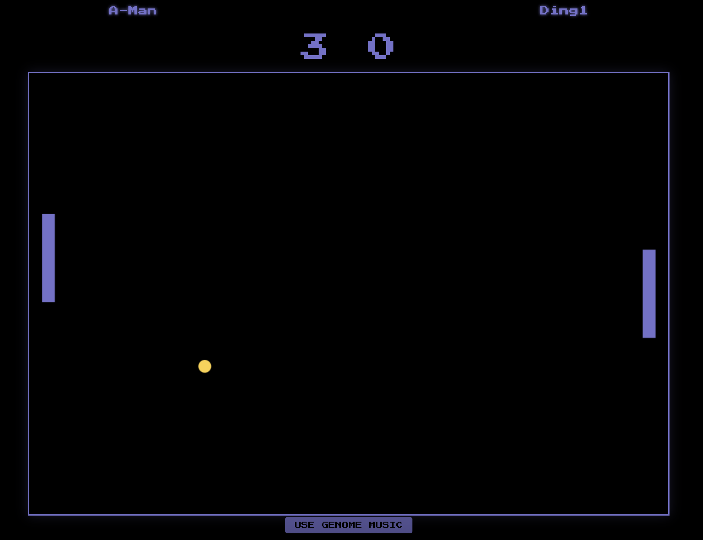
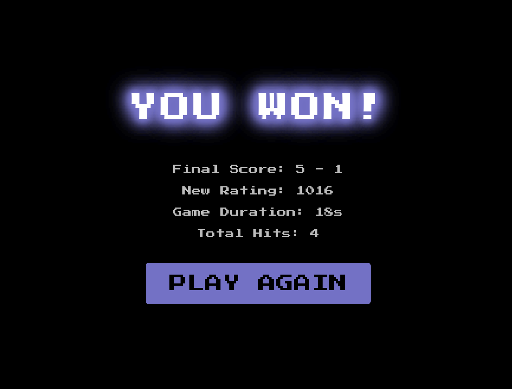

# PONG-IT

StacksPong is the Stacks-native PONG-IT fork: Clarity 4 escrow, STX staking,
Stacks Connect wallets, SIP-018 authentication, and backend-signed SIP-005
result proofs. The Socket.IO game engine and retro CRA interface remain intact.

Packages: `blockchain` (Clarinet), `backend`, `frontend`, and
`scripts/auto-player`. Each runnable package includes an `.env.example`.

&nbsp;


## Features

### Multiplayer Modes
- **Quick Match** - Instant matchmaking with random players
- **Private Rooms** - Create/join rooms with 6-character codes to play with friends
- **Multiple Simultaneous Games** - Many pairs of players can play at the same time

### Game Features
- Real-time multiplayer gameplay at 60 FPS
- ELO-based ranking system with live leaderboard updates
- Player statistics tracking (wins, losses, games played)
- Retro-style graphics with modern smoothing
- Original 80's inspired soundtrack
- Genome-based procedural music generation
- Touch and mouse controls for mobile/desktop
- Accurate staked prize reporting — My Wins shows full 2× payouts
- My Wins dashboard now surfaces total claimable/claimed ETH stats
- Claimable-only filter makes it easy to focus on pending prizes
- Game History cards now show staked payout totals with tooltips
- My Wins cards include a quick “Copy Room” action for support/debugging
- Game History and My Wins leverage shared ETH helpers to prevent rounding mistakes
- When the filter hides everything, use “Show All Wins” to reset the view
- Game History “Load More” now truly appends older matches
- My Wins “Load More” now appends earlier wins instead of replacing the list
- `/health` now reports the active backend CORS origins/source

### My Wins Experience
- Claim prizes directly via Wagmi hooks and see transaction updates inside a modal overlay.
- Summary cards highlight total claimable, claimed, and overall winnings calculated at 2× stakes.
- Toggle between all wins vs. claimable-only and copy room codes for support tickets.

### Game History Experience
- Filter by result or match type while Load More now appends older games instead of replacing them.
- Remaining game counts and tooltips make it easy to see how many matches are left.
- Staked games display stake + payout details so rewards are transparent.

## Architecture Overview

### System Components

```
┌─────────────────┐         ┌─────────────────┐         ┌─────────────────┐
│   Frontend      │         │    Backend      │         │ Player Service  │
│   (React)       │◄───────►│  (Node.js +     │◄───────►│  (Express API)  │
│   Port: 3000    │         │   Socket.IO)    │         │   Port: 5001    │
│                 │         │   Port: 8080    │         │                 │
└─────────────────┘         └─────────────────┘         └─────────────────┘
       │                            │                            │
       └────────────────────────────┴────────────────────────────┘
                              Docker Network
                            (app-network bridge)
```

### How It Works

#### 1. Frontend Layer (React Application)
**Location:** `frontend/src/`

**Responsibilities:**
- User interface and game rendering
- Socket.IO client connection to backend
- Canvas-based game rendering at 60 FPS
- Player input handling (keyboard, mouse, touch)
- Game mode selection (Quick Match, Create Room, Join Room)

**Key Files:**
- `components/Welcome.js` - Home screen with game mode buttons and leaderboard
- `hooks/useLeaderboardSubscription.js` - Consolidates HTTP + WebSocket leaderboard data
- `hooks/useBackendUrl.js` - Surfaces the resolved backend URL + source for debugging banners
- `utils/backendUrl.js` - Normalizes backend URL resolution/fallback logic shared by the entire frontend
- `utils/eth.js` - Shared ETH formatting helpers (stake → payout doubling, wei summation, trimming)
- `utils/pagination.js` - Helps merge paginated results without duplicating items
- `backend/src/utils/corsOrigins.js` - Provides sane defaults when `FRONTEND_URL` is missing
- `backend/scripts/showCorsConfig.js` - Quick helper to print the active backend CORS config
- `constants.js` - Stores `LEADERBOARD_LIMIT` so sockets and REST fetches stay in sync and now sources `BACKEND_URL` via a resolver that falls back to localhost during development.
- `components/MultiplayerGame.js` - Real-time multiplayer game logic
- `App.js` - React Router setup and username management

**Flow:**
1. User enters username (stored in localStorage)
2. Selects game mode:
   - **Quick Match**: `socket.emit('findRandomMatch', playerData)`
   - **Create Room**: `socket.emit('createRoom', playerData)`
   - **Join Room**: `socket.emit('joinRoom', { roomCode, player })`
3. Post-match rematch accepts route back to `/game`
3. Listens for events:
   - `gameStart` - Game begins
   - `gameUpdate` - Ball/paddle positions (60 times/second)
   - `gameOver` - Match results and rating changes
   - `leaderboardUpdate` (legacy alias: `rankingsUpdate`) - Live ranking updates
   - Pagination helpers keep large lists (Game History/My Wins) synchronized without duplicate cards

#### 2. Backend Layer (Node.js + Socket.IO)
**Location:** `backend/src/`

**Responsibilities:**
- WebSocket server for real-time communication
- Game state management for all active games
- Matchmaking logic (random + room-based)
- Game physics calculations
- ELO rating calculations
- Communication with Player Service
- Reads `MONGODB_URI` from environment (defaults to `mongodb://mongo:27017/pong-it`)
- Optional `SOCKET_HEADER_LOGS=true` to emit sanitized Socket.IO headers for debugging (defaults off)
- Leaderboard falls back to in-memory cache when no `PLAYER_SERVICE_URL` is set
- Default player rating is 1000 when no remote rating exists
- Keep `SOCKET_HEADER_LOGS=false` in production to avoid logging cookies/tokens

**Key Files:**
- `server.js` - Express + Socket.IO server setup
- `multiplayerHandler.js` - Main multiplayer logic coordinator
- `roomManager.js` - Room creation, joining, lifecycle management
- `gameManager.js` - Game state, ball physics, collision detection
- `leaderboardManager.js` - Rating calculations, player service integration

**Flow:**

**Room-Based Matchmaking:**
1. Client emits `createRoom`
2. RoomManager generates 6-character code (e.g., "XY4K2N")
3. Room stored in Map: `rooms.set(code, roomData)`
4. Backend emits `roomCreated` with code back to client
5. Another client emits `joinRoom` with same code
6. RoomManager validates and adds guest to room
7. Backend emits `gameStart` to both players in room

**Game Loop (per room):**
1. GameManager creates game state with ball, paddles, score
2. setInterval runs at 60 FPS:
   ```javascript
   setInterval(() => {
     const result = gameManager.updateGameState(roomCode);
     io.to(roomCode).emit('gameUpdate', result);
   }, 1000/60);
   ```
3. Ball physics calculated server-side
4. Collision detection with paddles
5. Score tracking
6. When score reaches 5:
   - Calculate ELO changes
   - Update Player Service
   - Emit `gameOver` with results
   - Broadcast `leaderboardUpdate` (and `rankingsUpdate` for backwards compatibility) to all clients

**Why Server-Side Game Logic?**
- Prevents cheating (clients can't manipulate game state)
- Ensures synchronized gameplay between players
- Single source of truth for ball position and score

#### 3. Player Service Layer (Express API)
**Location:** `player-service/src/`

**Responsibilities:**
- Player profile storage (in-memory Map)
- Rating persistence
- Statistics tracking (wins, losses, games played)
- Leaderboard queries

**Key Endpoints:**
- `GET /players/top?limit=10` - Top players by rating
- `GET /players/:name` - Individual player data
- `POST /players` - Create new player
- `PATCH /players/:name/rating` - Update rating after game

**Data Model:**
```javascript
{
  name: "Player1",
  rating: 1000,        // ELO rating (starts at 1000)
  gamesPlayed: 15,
  wins: 8,
  losses: 7,
  lastActive: Date
}
```

**Flow:**
1. Backend requests player rating before match
2. After game ends, backend sends new ratings
3. Player Service updates stats (wins/losses)
4. Backend fetches top players
5. Backend broadcasts to all connected clients

**Why Separate Service?**
- **Microservice Architecture** - Can be scaled independently
- **Data Isolation** - Player data separate from game logic
- **Future-Proof** - Easy to add database later without changing backend
- **Independent Deployment** - Can restart without affecting active games

### Docker Architecture

#### Role of Docker

Docker provides **containerization** - each service runs in an isolated environment with its own dependencies.

**Benefits:**
1. **Consistency** - "Works on my machine" → "Works everywhere"
2. **Isolation** - Services don't conflict (different Node versions, ports, etc.)
3. **Easy Setup** - `docker-compose up` starts entire system
4. **Scalability** - Can run multiple instances of any service

#### Docker Compose Configuration

**File:** `docker-compose.yml`

```yaml
services:
  frontend:
    build: ./frontend          # Build from frontend/Dockerfile
    ports: ["3000:3000"]       # Map host:container ports
    environment:
      - REACT_APP_BACKEND_URL=http://localhost:8080
    networks: [app-network]    # Connect to bridge network
    restart: unless-stopped    # Auto-restart on failure

  backend:
    build: ./backend
    ports: ["8080:8080"]
    environment:
      - PLAYER_SERVICE_URL=http://player-service:5001  # Docker DNS
    depends_on:
      - player-service         # Start after player-service
    networks: [app-network]
    restart: unless-stopped

  mongodb:
    image: mongo:7
    ports: ["27017:27017"]
    volumes: ["mongo-data:/data/db"]
    networks: [app-network]
    restart: unless-stopped

  player-service:
    build: ./player-service
    ports: ["5001:5001"]
    networks: [app-network]
    restart: unless-stopped

networks:
  app-network:
    driver: bridge             # Virtual network for inter-container communication
```
MongoDB is pinned to `mongo:7` to align local containers with current tools.
`depends_on` ensures startup order but does not wait for Mongo to be ready; add healthchecks if needed.

#### How Services Communicate

**1. Frontend → Backend (from Browser)**
- Uses `http://localhost:8080` (host machine port)
- WebSocket connection via Socket.IO
- CORS enabled for browser access
- When `REACT_APP_BACKEND_URL` is not set, the React app now falls back to this origin (or `http://localhost:8080`) and logs the detected source in the console to prevent silent failures.
- Optional: set `REACT_APP_BACKEND_URL_FALLBACK` to enforce a custom fallback origin when neither the env var nor `window.location.origin` apply (e.g., running from `file://`).
- Optional: set `REACT_APP_SHOW_BACKEND_URL_BANNER=false` to hide the development banner that explains which backend URL/source is in use.
- Backend counterpart: set `FRONTEND_URL` (preferred) or `FRONTEND_URL_FALLBACK` to restrict allowed origins; otherwise localhost defaults are used for development.
- Emergency mode: `FRONTEND_URL_ALLOW_ALL=true` sets a wildcard (development only, logs warnings).
- See `.env.example` for backend environment variables set during development.
- `MONGODB_URI` defaults to `mongodb://mongo:27017/pong-it` when using Docker Compose.
- `PLAYER_SERVICE_URL` is optional; when omitted, the backend serves leaderboard data from memory.
- Use `FRONTEND_URL_DEV_ORIGINS` (comma-separated) to customize the default allowlist for local gadgets.
- Audio assets now honor `PUBLIC_URL` so hosting under subpaths keeps sounds working.

**Backend URL Troubleshooting**
- Open the browser console to view the backend banner and confirm which origin/source is active.
- Override via `REACT_APP_BACKEND_URL` or `REACT_APP_BACKEND_URL_FALLBACK` if the detected origin is wrong.
- Hide the banner with `REACT_APP_SHOW_BACKEND_URL_BANNER=false` once configured.

**2. Backend → Player Service (Docker Network)**
- Uses `http://player-service:5001` (Docker DNS name)
- Services on same network can use service names
- Isolated from external access

**3. Docker Network Bridge**
```
Host Machine (localhost)
    ↓
Port 3000 → frontend container
Port 8080 → backend container  ──┐
Port 5001 → player-service ←─────┘ (internal network)
Port 27017 → mongodb container
```
MongoDB shares the `app-network` so the backend can reach it by hostname `mongo`.

**MongoDB Service**
- Stores player/game data at `mongodb://mongo:27017/pong-it` using the `mongo-data` volume.
- Remove the `mongo-data` volume to reset local data.
- Add connection retries/healthchecks if startup ordering is an issue.
- You can inspect data with MongoDB Compass at `mongodb://localhost:27017`.
- Local tools can connect on `localhost:27017` via the compose port mapping.
- The `mongo-data` volume will grow with matches; prune it if space is tight.
- Back up `mongo-data` if you need to preserve local progress.
- In production, enable Mongo auth and avoid exposing port 27017 publicly.

#### Docker Workflow

**Building Images:**
```bash
docker-compose build
```
Creates images from Dockerfiles:
- `frontend/Dockerfile` → Installs React dependencies, copies code
- `backend/Dockerfile` → Installs Node.js dependencies
- `player-service/Dockerfile` → Installs Express dependencies
- Validate the combined config with `docker-compose config`
- View Mongo logs: `docker-compose logs mongo`
- MongoDB data lives in the `mongo-data` volume
- Reset the volume with `docker volume rm celo-pong_mongo-data` if you need a clean DB
- Stop and remove containers/volumes with `docker-compose down -v`

**Starting Services:**
```bash
docker-compose up
```
1. Creates `app-network` bridge
2. Starts `player-service` first
3. Waits for it to be healthy
4. Starts `backend` (depends_on)
5. Starts `frontend` in parallel
6. All services can communicate via network

**Service Independence:**
- Each has its own filesystem
- Own Node.js version
- Own dependencies (node_modules)
- Own process (can crash/restart independently)
- Health checks ensure dependencies are ready

## Complete Data Flow Example

### Scenario: Two players start a private room game

**Step 1: Player1 Creates Room**
```
Frontend (Player1)        Backend                    RoomManager
     │                       │                            │
     ├─ createRoom ─────────>│                            │
     │   {name: "Alice"}     ├──── createRoom() ────────>│
     │                       │                            ├─ Generate code "ABC123"
     │                       │                            ├─ Store in Map
     │                       │<───── return code ─────────┤
     │<── roomCreated ───────┤
     │   {code: "ABC123"}    │
     │                       │
     │   Display: "Room Code: ABC123"
```

**Step 2: Player2 Joins Room**
```
Frontend (Player2)        Backend                    RoomManager
     │                       │                            │
     ├─ joinRoom ───────────>│                            │
     │   {code: "ABC123",    ├──── joinRoom() ──────────>│
     │    name: "Bob"}       │                            ├─ Validate code
     │                       │                            ├─ Add Bob to room
     │                       │<───── room ready ──────────┤
     │                       │
```

**Step 3: Game Starts**
```
Backend              GameManager           Both Players
   │                      │                      │
   ├─ createGame() ─────>│                      │
   │                      ├─ Init ball, paddles │
   │<──── gameState ──────┤                      │
   ├────── gameStart ──────────────────────────>│
   │        (room ABC123)                        │
   │                                             │
   ├─ Start 60 FPS loop                         │
   │                                             │
```

**Step 4: Gameplay (every 16ms)**
```
Player1              Backend                GameManager          Player2
   │                    │                        │                  │
   ├─ paddleMove ──────>│                        │                  │
   │   {position: 0.5}  ├─ updatePaddle() ─────>│                  │
   │                    │                        │                  │
   │                    │<─── gameState ─────────┤                  │
   │<── gameUpdate ─────┴────────────────────────┴──── gameUpdate ─>│
   │   {ball: {x, y}, paddles, score}                               │
```

**Step 5: Game Ends**
```
Backend          LeaderboardManager    Player Service    All Clients
   │                    │                     │                │
   ├─ Score = 5        │                     │                │
   ├─ processGameResult()                    │                │
   │                    ├─ getPlayerRating()->│                │
   │                    │<─── 1050 ───────────┤                │
   │                    ├─ calculateElo()     │                │
   │                    │   (1050 + 25 = 1075)│                │
   │                    ├─ updateRating() ───>│                │
   │                    │                     ├─ Save to Map   │
   │                    ├─ getTopPlayers() ──>│                │
   │                    │<─── top 10 ─────────┤                │
   ├────────────── gameOver ──────────────────┴──────────────>│
   ├────────────── leaderboardUpdate ────────────────────────>│
```

## Prerequisites

- Docker (v20.10+)
- Docker Compose (v2.0+)
- Modern browser with WebSocket support

## Getting Started

### 1. Clone the repository

```bash
git clone https://github.com/escapeSeq/k-pong.git
cd k-pong
```

### 2. Start the application

```bash
docker-compose up --build
```

This will:
- Build all three services
- Create the Docker network
- Start containers in correct order
- Show logs from all services

### 3. Access the game

Open your browser and navigate to: `http://localhost:3000`

### 4. Play the game

**Quick Match:**
1. Enter username
2. Click "Quick Match"
3. Wait for opponent
4. Game starts automatically

**Private Room:**
1. Player 1: Click "Create Private Room"
2. Share the 6-character code with friend
3. Player 2: Click "Join Room" and enter code
4. Game starts when both connected

### Development Mode

Run individual services locally:

```bash
# Backend
cd backend
pnpm install
pnpm dev

# Frontend
cd frontend
pnpm install
pnpm start

# Player Service
cd player-service
pnpm install
pnpm dev
```

## Gameplay

### Controls
- **Keyboard**: UP/DOWN arrow keys
- **Mouse**: Move cursor up/down
- **Touch**: Touch and drag on mobile

### Rules
- First player to 5 points wins
- Ball speed increases after each paddle hit
- ELO rating changes based on opponent's rating

### Game Modes

| Mode | Description | Use Case |
|------|-------------|----------|
| Quick Match | Instant random matchmaking | Play with anyone online |
| Create Room | Generate shareable code | Play with friends |
| Join Room | Enter 6-char code | Join friend's game |

## Technologies Used

### Frontend
- React 18
- Socket.IO Client
- React Router v6
- HTML5 Canvas
- Web Audio API
- Static assets (sounds) resolve via `PUBLIC_URL` for subpath hosting

### Backend
- Node.js 18
- Express.js
- Socket.IO 4
- Custom game engine

### Player Service
- Node.js 16
- Express.js
- In-memory data store

### Infrastructure
- Docker & Docker Compose
- Bridge networking
- Multi-stage builds

## Project Structure

```
k-pong/
├── frontend/
│   ├── src/
│   │   ├── components/
│   │   │   ├── Welcome.js           # Home screen + leaderboard
│   │   │   ├── MultiplayerGame.js   # Real-time game component
│   │   │   └── GameOver.js          # Results screen
│   │   ├── utils/
│   │   │   └── soundManager.js      # Audio handling
│   │   └── App.js
│   ├── Dockerfile
│   └── package.json
│
├── backend/
│   ├── src/
│   │   ├── server.js                # Express + Socket.IO setup
│   │   ├── multiplayerHandler.js    # Socket event handlers
│   │   ├── roomManager.js           # Room lifecycle
│   │   ├── gameManager.js           # Game physics
│   │   ├── leaderboardManager.js    # ELO + player service
│   │   ├── gameHandlers.js          # Legacy handlers
│   │   └── utils/
│   │       └── eloCalculator.js
│   ├── Dockerfile
│   └── package.json
│
├── player-service/
│   ├── src/
│   │   └── server.js                # REST API
│   ├── Dockerfile
│   └── package.json
│
└── docker-compose.yml
```

## API Documentation

### Player Service Endpoints

```
GET    /health                          # Health check
GET    /players                         # All players
GET    /players/top?limit=10           # Top players
GET    /players/:name                   # Single player
POST   /players                         # Create player
PATCH  /players/:name/rating           # Update rating
```

### Socket.IO Events

**Client → Server:**
```javascript
socket.emit('findRandomMatch', playerData)
socket.emit('createRoom', playerData)
socket.emit('joinRoom', { roomCode, player })
socket.emit('paddleMove', { position })
socket.emit('leaveRoom')
```

**Server → Client:**
```javascript
socket.on('roomCreated', (data))
socket.on('waitingForOpponent', (data))
socket.on('gameStart', (gameState))
socket.on('gameUpdate', (gameState))
socket.on('gameOver', (result))
socket.on('leaderboardUpdate', (topPlayers))
socket.on('opponentLeft')
socket.on('error', (error))
```

## Contributing

1. Fork the repository
2. Create feature branch (`git checkout -b feature/amazing-feature`)
3. Commit changes (`git commit -m 'Add amazing feature'`)
4. Push to branch (`git push origin feature/amazing-feature`)
5. Open Pull Request

## License

This project is licensed under the MIT License. See the LICENSE file for details.

## Acknowledgments

- Original Pong game by Atari (1972)
- Socket.IO for real-time communication
- Docker for containerization
- Run `pnpm run show:cors` (or `npm run show:cors`) to verify the backend CORS configuration without starting the server.
- Run `pnpm run test:cors` to see how different env combinations resolve.
- See `docs/dev-notes/note-91-cors-debugging.md` for more context.
